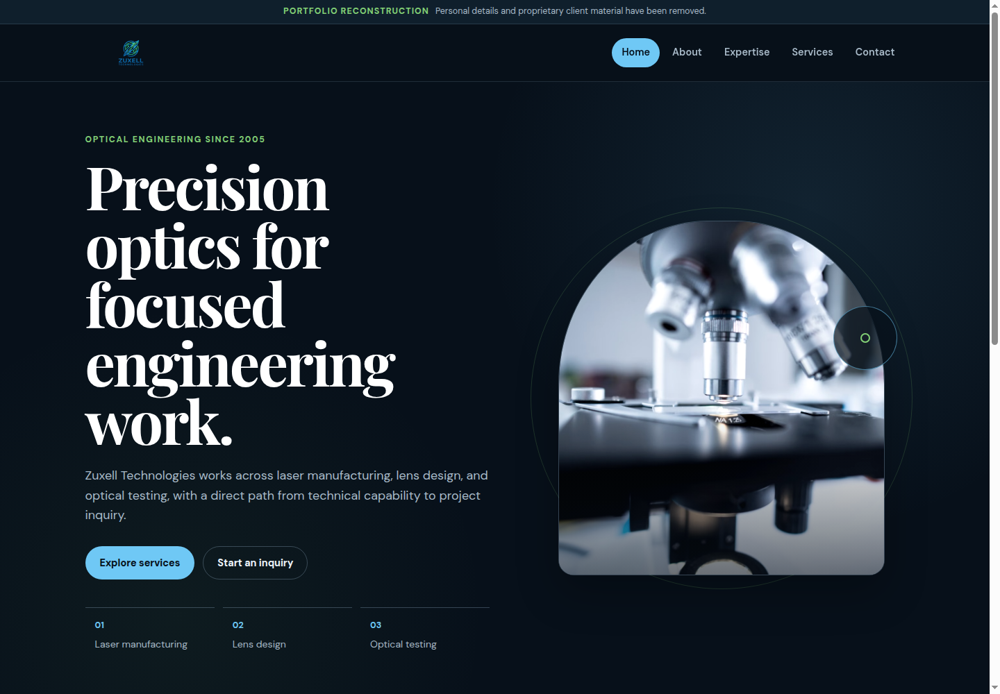
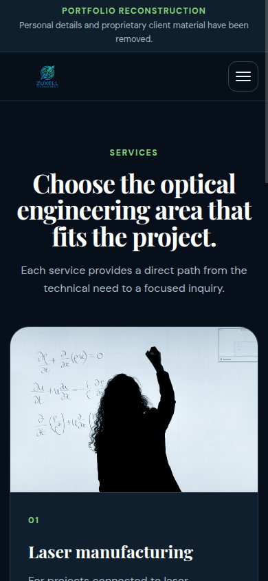
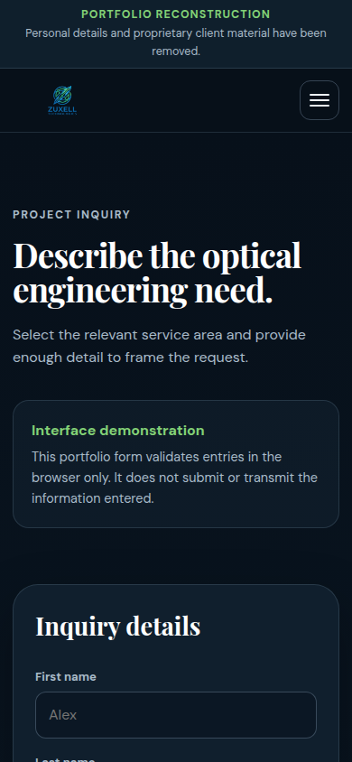

# Webza x Zuxell Technologies

<p align="center">
  <strong>A four-person real-client web project combining client acquisition, audience-specific design, front-end development, business thinking, iteration, and team execution for an optical engineering company.</strong>
</p>

<p align="center">
  HTML · CSS · JavaScript
</p>

<p align="center">
  <a href="https://webza-zuxell-technologies-portfolio.vercel.app/"><strong>Live Zuxell showcase</strong></a>
  &nbsp;·&nbsp;
  <a href="https://webzacrew.netlify.app/"><strong>Original Webza agency site</strong></a>
</p>

<p align="center">
  <a href="https://github.com/kzhu37/Webza-ZuxellTechnologiesWebsite-Portfolio/actions/workflows/verify.yml"></a>
</p>

> **Public showcase note:** The live Zuxell site is a sanitized reconstruction for this portfolio. Personal details, location information, proprietary client material, and unsupported placeholder claims were removed. The original spring project and later public-release work are identified separately below.

<table>
  <tr>
    <th width="50%">Zuxell Technologies</th>
    <th width="50%">Webza</th>
  </tr>
  <tr>
    <td></td>
    <td></td>
  </tr>
  <tr>
    <td align="center"><sub><strong>Client direction:</strong> restrained, technical, and credibility-focused. This image is from the later sanitized public reconstruction.</sub></td>
    <td align="center"><sub><strong>Agency direction:</strong> bolder and more promotional because Webza itself was the service being marketed. This is an original spring 2026 capture.</sub></td>
  </tr>
</table>

<p align="center">
  <a href="#from-idea-to-real-client">Story</a> ·
  <a href="#two-products-two-audiences">Design</a> ·
  <a href="#iteration-and-design-decisions">Iteration</a> ·
  <a href="#technical-evolution">Technical</a> ·
  <a href="#what-i-would-change-next-time">Reflection</a> ·
  <a href="#collaboration-and-attribution">Attribution</a>
</p>

## At a glance

| | |
| --- | --- |
| **Project type** | Real-client web design and development |
| **Team** | Kevin Zhu, Vladimir Dukkardt, Michael Tetelbaum, Algasem Zabarah |
| **Development** | Late February to April 9, 2026 |
| **Client** | Zuxell Technologies |
| **Deliverables** | Zuxell client website, Webza agency website, revision cycle, final startup-style pitch |
| **Core stack** | HTML, CSS, JavaScript |
| **Client brief** | Home, About Us, Expertise, Services, Contact Us |
| **My role** | Client connection, shared implementation, business and service framing, coordination, revision, and project communication |
| **Public evidence** | Original Webza site and screenshot, preserved Zuxell source checkpoints, current sanitized Zuxell reconstruction, dated development history |

<p align="center">
  
</p>

## What shipped

The project produced four connected outputs:

1. **A client-facing Zuxell site** built around an external five-section brief and a restrained technical identity.
2. **A separate Webza agency site** with a deliberately more promotional direction for a different audience.
3. **A revision cycle** in which the first complete Zuxell build was revisited after feedback instead of being treated as finished.
4. **A final startup-style pitch** connecting outreach, client discovery, implementation, design choices, challenges, revision, business framing, and lessons.

## My contribution

This was collaborative work. The surviving project record is reliable at the level of broad responsibilities, but not precise enough to reconstruct file-by-file authorship after the fact.

| Area | My contribution |
| --- | --- |
| **Project direction** | Helped push the group toward a real-client engagement instead of stopping at a hypothetical brief |
| **Client acquisition** | Participated in outreach and ultimately connected the team with Zuxell Technologies through a family connection |
| **Implementation** | Worked on coding and revision alongside Michael, while Vladimir led much of the UI, design, and visual-consistency work |
| **Business framing** | Helped shape Webza's service positioning, pricing thinking, maintenance model, and value proposition without treating the project as only a coding exercise |
| **Coordination** | Helped keep the client site, agency site, revision work, and final pitch moving as team availability changed |
| **Communication** | Helped shape the chronological pitch, challenge explanations, audience contrast, and final lessons |

The retained notes describe **Michael and me as handling much of the coding**, **Vladimir as leading much of the interface and visual direction**, and **Algasem as concentrating more heavily on presentation work**. Responsibilities overlapped, so this repository does not claim exclusive ownership of individual modules that the record cannot support.

## From idea to real client

Webza began as a small web-design agency concept. We wanted to build custom websites around the needs of individual businesses instead of creating another fictional brief where we controlled every requirement ourselves.

We compiled a list of local businesses, divided outreach across the team, and dealt with repeated rejections or no response. That made finding the problem part of the project rather than assuming a client would already be waiting.

In early March, I connected the team with **Zuxell Technologies through a family connection**. Zuxell worked in optical engineering and needed a website. The requirements note specified five core areas:

```text
Home
About Us
Expertise
Services
Contact Us
```

It also pointed us toward an established optics-industry website as a reference. From that point on, we had external constraints: understand an unfamiliar technical business, decide what technical visitors needed first, and make design decisions for somebody else's audience.

## Two products, two audiences

The project produced two related websites, but they were intentionally not designed to look alike.

| | **Zuxell client site** | **Webza agency site** |
| --- | --- | --- |
| **Audience** | Engineering clients and technical visitors | Businesses looking for web-design help |
| **Goal** | Establish clarity and technical credibility | Show personality, capability, and service positioning |
| **Visual direction** | Restrained, precise, professional | Bold, expressive, pitch-driven |
| **Content focus** | Optical-engineering services and inquiry | Agency identity, services, team, and process |
| **Role in the project** | External client deliverable | Our own storefront and service showcase |

The Zuxell direction centered the three service areas preserved in the client materials: **laser manufacturing, lens design, and optical testing**. The landing page was treated as the key first impression, so the client site emphasized clarity, trust, and technical restraint.

Webza could be more promotional because the agency itself was the product being marketed. The surviving agency site presents service categories around **design, speed, mobile responsiveness, security, strategy, and support**. The presentation materials also framed the service around an initial website build plus ongoing maintenance.

<p align="center">
  <a href="https://webzacrew.netlify.app/"><strong>Open the original spring 2026 Webza site</strong></a>
</p>

The two-site contrast became one of the clearest lessons from the project: **design should respond to audience, purpose, and context instead of applying one preferred style everywhere.**

## Iteration and design decisions

The first complete Zuxell version was built before March Break and was not treated as final. After March Break, we returned to the client site, reviewed feedback, clarified sections, polished the visual direction, and strengthened the landing-page experience.

The preserved source history records a concrete implementation change at the same time. A **March 9** checkpoint kept most structure, styling, and interaction in one large `index.html`. By the **April 4** revision, the project had separated structure, styling, and interaction into `index.html`, `style.css`, and `script.js` while expanding the interaction layer.

| Observation or constraint | Decision | Result |
| --- | --- | --- |
| A fictional client would have been easier but less meaningful | Keep pursuing a real organization despite unsuccessful outreach | The project gained external requirements and a real stakeholder context |
| The first client build was useful but still provisional | Return to the site after March Break and revise it | Sections became clearer and the landing-page direction was polished |
| Zuxell and Webza served different audiences | Give each product its own visual identity and content priorities | Zuxell became restrained and technical while Webza became bolder and more promotional |
| The early client implementation was tightly coupled | Separate structure, styling, and interaction during revision | The codebase became easier to reason about and continue refining |
| Team availability shifted after March Break | Reprioritize work and clarify handoffs | The client site, agency site, and pitch continued moving despite coordination constraints |
| The agency, client, revision work, and two sites risked feeling disconnected | Rebuild the final pitch around one chronological story | The presentation connected outreach, client work, design decisions, challenges, revision, and reflection |

<p align="center">
  
</p>

The public repository does not contain an untouched spring Zuxell screenshot because one did not survive in the retained materials. Instead, the dated source checkpoints are preserved privately and summarized in [`docs/DEVELOPMENT_HISTORY.md`](docs/DEVELOPMENT_HISTORY.md). The original Webza screenshot and live agency site remain available as direct spring artifacts.

## Technical evolution

The project used browser fundamentals rather than a front-end framework. The technical challenge was therefore not framework complexity. It was building and revising two coherent interfaces, handling responsive behavior and interaction, and making the implementation fit different audiences.

### Original spring implementation

The **March 9** client checkpoint concentrated most of the interface in one large `index.html`. By **April 4**, structure, styling, and interaction had been separated into focused files:

```text
index.html  -> structure and content
style.css   -> visual system and responsive layout
script.js   -> navigation and interaction
```

The April interaction layer experimented with an optics-themed entrance, desktop and mobile navigation, contact interaction, scroll reveals, navbar scroll effects, rotating headline text, animated counters, card tilt, parallax, progress indication, and staggered reveal behavior.

Not every effect survived later review. That became an engineering and design lesson: more interaction is not automatically better interaction. The client direction called for precision and credibility, so the later public showcase keeps the optics identity while removing motion that competes with the content.

### Current public reconstruction

The current Zuxell showcase keeps the lightweight HTML, CSS, and JavaScript stack while adding:

- semantic section structure and hash-based navigation;
- responsive desktop, tablet, and mobile layouts;
- keyboard-operable navigation with focus restoration and focus trapping for the mobile menu;
- visible focus states and reduced-motion support;
- a browser-only inquiry demonstration that uses native validity checks without transmitting data;
- dependency-free local serving and automated content, server, and browser smoke checks.

The browser interaction code is intentionally small. `script.js` manages section routing, navigation state, menu accessibility, keyboard behavior, inquiry validation, and the current year without adding a framework or runtime dependency.

<table>
  <tr>
    <td width="50%"></td>
    <td width="50%"></td>
  </tr>
  <tr>
    <td align="center"><sub>Responsive services layout on a narrow viewport.</sub></td>
    <td align="center"><sub>Browser-only inquiry interface with no submission endpoint.</sub></td>
  </tr>
</table>

### Verification

The repository runs `npm test` on pushes to `main` and on pull requests. Verification combines JavaScript syntax checks with content, server, and browser smoke tests. Browser checks cover desktop through narrow-mobile layouts, hash navigation, mobile-menu accessibility state, focus restoration, inquiry validation, missing alternative text, placeholder links, metadata, and console errors.

The content audit also rejects long dash characters across public text files so the repository stays consistent with its writing standard.

## What I would change next time

**Formalize client onboarding earlier.** We had a requirements note, but a stronger engagement would define scope, content ownership, revision expectations, and a feedback schedule before development accelerated.

**Define ownership and handoffs earlier.** Team availability changed during the project. Clearer responsibility boundaries, earlier check-ins, and a shared task tracker would have reduced coordination friction.

**Treat outreach and documentation as part of the engineering process.** A more systematic outreach tracker, clearer revision notes, and preserved before-and-after evidence would have made both the process and the final project history easier to evaluate.

**Shape the story while building, not only before presenting.** The final pitch forced us to connect the agency, client, design choices, challenges, revisions, and business framing into one understandable sequence. Doing that earlier would have improved both the product process and the explanation of our decisions.

The biggest lesson was that software becomes more demanding when the constraints come from real people. Technical implementation still matters, but so do trust, scope, communication, audience, revision, and the ability to explain why a design decision exists.

## Public-release boundaries

The current Zuxell site is a **sanitized reconstruction**, not an untouched spring artifact. The original development copy contains client material and early placeholder claims that should not be public.

The later public-release work intentionally:

- keeps the documented client structure and supported service areas;
- removes unsupported statistics, certifications, client logos, testimonials, and other placeholder claims;
- removes generic motion that competed with the restrained client direction;
- improves keyboard, mobile, focus, and reduced-motion behavior;
- keeps inquiry validation entirely in the browser, with no submission endpoint;
- adds lightweight automated checks for layout, navigation, accessibility state, content hygiene, and console failures.

These later improvements strengthen the public artifact, but they are not retroactively presented as original spring work. The separation is documented in [`docs/DEVELOPMENT_HISTORY.md`](docs/DEVELOPMENT_HISTORY.md).

## Run locally

### Requirements

- Node.js 22 or newer
- Chrome, Chromium, or Microsoft Edge for the browser smoke test
- No install step
- No runtime package dependencies

```bash
npm start
```

Open the local URL printed in the terminal.

To run the complete verification path:

```bash
npm test
```

## Repository map

- `index.html`: current public Zuxell reconstruction
- `style.css`: responsive visual system
- `script.js`: navigation, focus behavior, and inquiry validation
- `dev-server.js`: dependency-free local server
- `tests/`: content, server, and browser smoke checks
- `.github/workflows/verify.yml`: automated verification on pushes and pull requests
- `docs/DEVELOPMENT_HISTORY.md`: original project chronology, evidence boundaries, and later public-release work
- `docs/diagrams/`: project timeline and implementation-evolution visuals
- `docs/assets/screenshots/`: current Zuxell captures and original Webza capture
- `ATTRIBUTION.md`: collaboration, media, and source notes

## Collaboration and attribution

The original spring 2026 project was collaborative work by **Kevin Zhu, Vladimir Dukkardt, Michael Tetelbaum, and Algasem Zabarah**.

The current Zuxell reconstruction references demonstration photography from Pexels and loads DM Sans and Playfair Display through Google Fonts. See [`ATTRIBUTION.md`](ATTRIBUTION.md) for the detailed media and collaboration notes.

The project does not claim details that the surviving record cannot support, including an exact final client quotation, formal final approval before the April 9 pitch, traffic, conversion, client revenue, or a precise module-by-module authorship breakdown.
