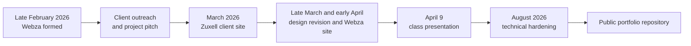
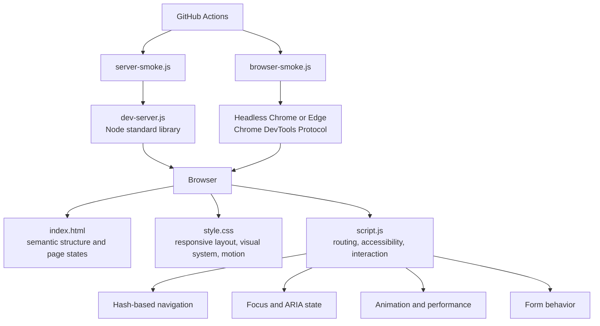

# Webza × Zuxell Technologies

**A Grade 12 computer science project that grew into a real-client web design and engineering experience.**

[](https://github.com/kzhu37/Webza-ZuxellTechnologiesWebsite-Portfolio/actions/workflows/portfolio-ci.yml)

Webza began as a four-person school project in spring 2026. Instead of inventing a fictional website brief, our team tried to operate like a small web agency, contacted real businesses, connected with Zuxell Technologies, and built a client-facing website around its optical engineering work.

The project later became more than the version presented in class. In August 2026, I led a separate technical refinement of the Zuxell site, improving responsive behavior, accessibility, browser interaction, local development tooling, and automated testing before migrating the result into this public portfolio repository.

<p align="center">
  
</p>

<p align="center"><em>Current portfolio version. The public demo intentionally limits company claims to information supported by the original project materials.</em></p>

## Quick Facts

| | |
| --- | --- |
| **Project type** | Real-client web design and front-end engineering project |
| **Original context** | Grade 12 Computer Science, four-person team |
| **Original development** | February to April 2026 |
| **Presentation** | April 9, 2026 |
| **Later portfolio refinement** | August 2026 |
| **My role** | Client and business direction, coordination, technical development, later portfolio hardening |
| **Core stack** | HTML, CSS, JavaScript, Node.js |
| **Testing** | Server smoke tests plus headless Chromium tests through the Chrome DevTools Protocol |
| **Related deliverable** | [Webza agency website](https://webzacrew.netlify.app/) |

## From a School Assignment to a Real Client

The most important decision in this project happened before most of the coding.

Our assignment was open-ended enough that we could have created another fictional product. Instead, we formed **Webza**, a student web-design group, and tried to find a real organization whose needs would force us to design for someone other than ourselves. Early outreach did not immediately work. After repeated attempts, we reached Zuxell Technologies through a personal connection and turned the class project into a client-oriented redesign.

That changed the problem. Zuxell was not supposed to look like Webza. The client site needed to feel precise, credible, restrained, and appropriate for an optical engineering audience, while Webza's own agency site could be more experimental and personality-driven.



The original source history also confirms that the project evolved across multiple stages. An early full-interface snapshot was committed on March 9, the landing-page design was revised in early April, and the later portfolio hardening was completed in August.

## What We Built

The original project had **two connected products**.

### 1. Zuxell Technologies website

The client-facing site translated an optical engineering brief into a clearer digital experience. The original project materials identified three core service areas: **laser manufacturing, lens design, and optical testing**. The current public version keeps those documented areas while removing later prototype copy that could not be independently verified.

The portfolio version includes:

- six routed interface states: Home, About, Expertise, Services, Approach, and Contact
- an optics-inspired lens intro built with CSS
- responsive navigation with a keyboard-accessible mobile menu
- desktop, tablet, mobile, and narrow-mobile layouts
- visible keyboard focus states and reduced-motion behavior
- a form-validation demo that does not transmit user data
- performance-aware scroll, pointer, reveal, and text-rotation effects

### 2. Webza agency website

The team also created Webza's own public-facing site to explain the agency concept, introduce the team, and communicate services such as design, mobile responsiveness, performance, security, strategy, and support.

[View the related Webza agency site](https://webzacrew.netlify.app/)

Building both sites made one design lesson especially clear: **good UI is not a single visual style. It is the ability to adapt the interface to the audience and purpose.**

## My Contribution

This was a collaborative four-person project, not an individual assignment, and the original source history includes meaningful work from multiple teammates.

My contribution centered on:

- helping push the assignment toward a real-client project rather than a fictional brief
- client and business direction, including how Webza should position and explain its work
- project coordination across the client site, agency site, and presentation
- technical implementation during the original project
- later ownership of the portfolio refinement process

In August 2026, I led a separate technical overhaul before this public migration. That work added or strengthened responsive layouts, accessible navigation and focus management, reduced-motion support, semantic markup, metadata, image-loading behavior, contact-form validation, animation performance, a dependency-free Node development server, and automated server and browser smoke tests.

I do **not** present the current repository's migration commit as proof that I individually wrote the entire original group project. The public repository was created later, so its visible Git history is a curated portfolio history rather than the complete spring 2026 authorship record.

## Technical Architecture

The current build intentionally stays close to browser fundamentals. There is no front-end framework and no runtime npm dependency.



### Framework-free navigation

[`script.js`](./script.js) treats the page as a lightweight single-page interface. URL hashes select one of six logical views, navigation state is synchronized across desktop and mobile controls, and inactive pages are marked with both `aria-hidden` and `inert` so hidden content is removed from the active interaction flow.

The special `#founder` route from the earlier prototype remains supported internally, but the current evidence-based public content no longer depends on unverified staff biographies.

### Accessibility as behavior, not decoration

Accessibility work is implemented directly in the interaction model:

- a skip link moves keyboard users directly to main content
- the lens intro supports keyboard entry and does not trap reduced-motion users
- the mobile menu moves focus inside when opened, traps Tab navigation, closes with Escape, and restores focus to the trigger
- `aria-expanded`, `aria-hidden`, and `aria-current` follow UI state
- inactive page panels use `inert`
- all form fields have associated labels
- visible focus styles are preserved
- `prefers-reduced-motion` disables or shortens motion throughout the interface

### Performance-aware interaction

The project uses browser APIs rather than continuously running animation loops:

- `IntersectionObserver` starts reveal effects only when content becomes relevant
- statistic and reveal logic is activated only when the corresponding elements exist
- scroll and pointer work is consolidated through `requestAnimationFrame`
- mouse-based effects run only on fine-pointer devices
- rotating hero text pauses while the document is hidden
- the intro is remembered through `sessionStorage` so it does not repeat throughout the same browsing session

### Dependency-free development server

[`dev-server.js`](./dev-server.js) uses only Node's standard library. It handles static-file delivery, content types, GET and HEAD requests, 400, 403, 404, and 405 responses, path-traversal protection, `X-Content-Type-Options: nosniff`, streaming, graceful shutdown, and automatic nearby-port fallback if port 8080 is already occupied.

That port fallback came from a real development inconvenience: a local server already using port 8080 should not stop the entire project from starting.

## Automated Validation

For a website project, I wanted testing to cover more than whether the page opened.

### Server smoke tests

[`tests/server-smoke.js`](./tests/server-smoke.js) starts an isolated server on a dynamically assigned port and verifies **7 HTTP behaviors**:

1. home-page delivery
2. stylesheet HEAD behavior
3. JavaScript delivery
4. logo delivery
5. missing-file handling
6. unsupported-method handling
7. path-traversal rejection

### Browser smoke tests

[`tests/browser-smoke.js`](./tests/browser-smoke.js) launches Chrome or Edge headlessly and communicates with the browser directly through the **Chrome DevTools Protocol** using a small WebSocket client.

The suite checks the interface at **6 viewport configurations**:

| Viewport | Size |
| --- | ---: |
| Desktop | 1440 × 1000 |
| Laptop | 1024 × 768 |
| Small laptop | 820 × 900 |
| Tablet | 768 × 1024 |
| Mobile | 390 × 844 |
| Narrow mobile | 320 × 568 |

It also exercises all six routed views, detects horizontal overflow, checks header spacing, validates mobile-menu focus behavior, tests required form fields and label associations, looks for placeholder links and missing metadata, monitors console and network failures, and captures regression screenshots.

<p align="center">
  
  &nbsp;&nbsp;
  
</p>

The same test suite runs in GitHub Actions on pull requests and pushes to `main`.

## Design Decisions

### 1. Use the client's field as a visual language

The lens intro is not intended to be a generic loading animation. It connects directly to the optical engineering context. The magnifying glass is built primarily from CSS gradients, borders, masking, reflections, shadows, transforms, and keyframes.

### 2. Make motion optional

The project originally experimented heavily with visual effects. The later refinement kept the strongest ideas while making them conditional. Touch devices do not need desktop pointer tilt, users who prefer reduced motion should not be forced through an animated intro, and background effects should not perform unnecessary work while hidden.

### 3. Remove claims that cannot be supported

A later prototype version contained illustrative company statistics, testimonials, staff biographies, office locations, and named-client references. Those looked polished, but they were not supported by the project record available for this portfolio.

For this public version, I removed them rather than allowing prototype copy to become an admissions claim. The current site focuses on documented project facts and the three service areas present in the original materials.

That cleanup is part of the engineering work: credibility is a product requirement too.

## Challenges, Iteration, and Growth

### Finding a real problem

The first challenge was not code. We had to convince an external organization to trust a student team. Early outreach did not immediately produce a client, so we kept refining the pitch and eventually reached Zuxell through a personal connection.

### Balancing creativity with credibility

Webza could be bold and experimental. Zuxell could not simply inherit the same personality. The client site needed stronger restraint, more technical hierarchy, and a visual identity tied to optics rather than to the student team itself.

### Coordinating an imperfect group process

The work crossed March Break, teammate availability changed, and the client site and agency site were developed in parallel. That created the kinds of problems that do not appear in a coding tutorial: overlapping responsibilities, unclear ownership, scope decisions, and the need to keep moving when the full team was not available.

### Learning that building and explaining are different skills

After the final presentation, audience questions showed that the relationship between Webza, Zuxell, and the two websites had not been explained as clearly as we thought.

That is one reason this portfolio presentation is structured so explicitly around **problem, client, product, contribution, architecture, and evidence**. Good engineering communication should reduce the work required to understand the system.

## AI-Assisted Development

AI-assisted tools were used during the project and later refinement for brainstorming, debugging, implementation support, and iteration. The project presentation summarized the lesson as **"AI is a multiplier, not a replacement."**

For this portfolio, that means being transparent about assistance while still being responsible for the important engineering decisions: what problem to solve, what to keep or remove, how the client context should shape the design, how components should work together, what counts as a credible claim, and whether the resulting behavior passes validation.

## Run Locally

Requirements:

- Node.js 22 recommended
- Chrome or Edge for the browser smoke suite

```bash
git clone https://github.com/kzhu37/Webza-ZuxellTechnologiesWebsite-Portfolio.git
cd Webza-ZuxellTechnologiesWebsite-Portfolio
npm start
```

The development server prefers `http://127.0.0.1:8080`. If that port is occupied and no explicit `PORT` value is provided, it tries nearby ports automatically and prints the active URL.

Run the complete validation suite with:

```bash
npm test
```

Because the project has no runtime npm dependencies, there is no package-install step required for normal use.

## Repository Structure

```text
.
├── index.html                  # Semantic page structure and portfolio-safe client copy
├── style.css                   # Responsive layout, visual system, and motion
├── script.js                   # Routing, accessibility state, animation, and form logic
├── dev-server.js               # Dependency-free local HTTP server
├── LOGOZuxell.png              # Client logo asset
├── package.json                # Development and validation commands
├── tests/
│   ├── server-smoke.js         # HTTP behavior and traversal checks
│   └── browser-smoke.js        # CDP-driven browser and responsive checks
├── docs/assets/screenshots/    # Regression screenshots used in this README
└── .github/workflows/
    └── portfolio-ci.yml        # Automated validation
```

## Team and Project Provenance

Original Webza team:

- **Kevin Zhu**
- **Vladimir Dukkardt**
- **Michael Tetelbaum**
- **Algasem Zabarah**

The original project was collaborative and developed during spring 2026. The public repository was created on August 25, 2026 and migrated from earlier source material, so the commit history visible here does not reproduce the full original team history.

This repository is intentionally a **curated technical portfolio**, not a raw school-project archive. Historical presentation materials were used to reconstruct the timeline, challenges, and reflections, but personal team photographs and ambiguous presentation mockups were not republished merely for decoration.

## What This Project Demonstrates

For me, the strongest lesson from Webza is not that I learned to make a polished website. It is that software projects become more interesting when the constraints come from real people.

Finding the client, translating a technical business into a usable interface, working within a team, learning unfamiliar tools, recognizing where our presentation was unclear, continuing the project after the course ended, and later hardening the result with accessibility and automated testing all mattered more than any single visual effect.

That progression is why this project remains in my portfolio.
