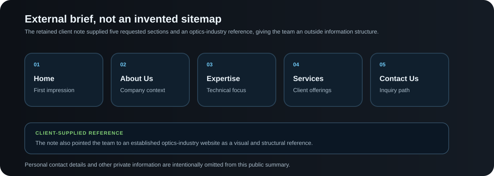
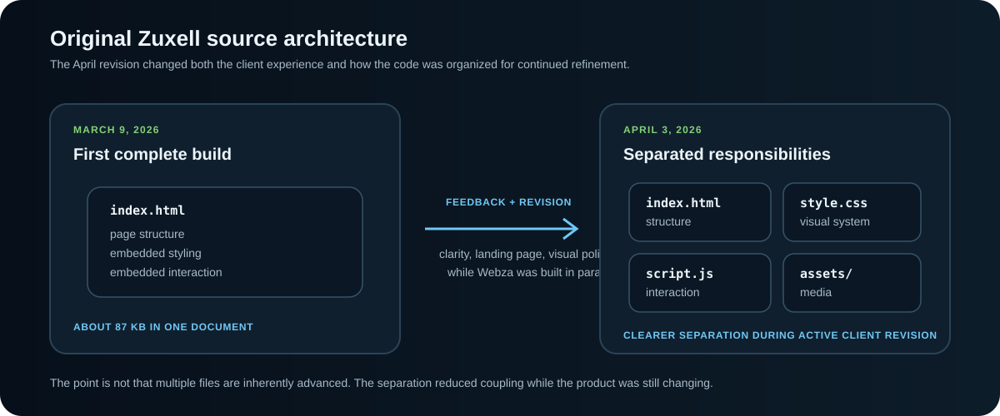

# Webza x Zuxell Technologies

<p align="center">
  <strong>A four-person Spring 2026 real-client web project that turned outreach, external requirements, feedback, and an unfamiliar optical-engineering domain into two audience-specific web products.</strong>
</p>

<p align="center">
  HTML · CSS · JavaScript
</p>

<p align="center">
  <a href="https://webzacrew.netlify.app/"><strong>Open Original Spring Webza</strong></a>
  &nbsp;·&nbsp;
  <a href="https://webza-zuxell-technologies-portfolio.vercel.app/"><strong>Inspect Zuxell Reconstruction</strong></a>
  &nbsp;·&nbsp;
  <a href="https://github.com/kzhu37/Webza-ZuxellTechnologiesWebsite-Portfolio/actions/workflows/verify.yml"></a>
</p>

<table>
  <tr>
    <td width="50%">
      
    </td>
    <td width="50%">
      
    </td>
  </tr>
  <tr>
    <td align="center"><sub><strong>Original Spring Webza:</strong> expressive agency storefront built to present our web-design service.</sub></td>
    <td align="center"><sub><strong>Zuxell client site:</strong> a later public recreation of the restrained, technical design created for the client.</sub></td>
  </tr>
</table>

> **About these visuals:** The Webza image shows the original Spring 2026 site. The Zuxell image shows a later public recreation of the client-facing design, with private client material removed.

<p align="center">
  <a href="docs/ORIGINAL_TECHNICAL_EVIDENCE.md"><strong>Original Zuxell Technical Evidence</strong></a>
  &nbsp;·&nbsp;
  <a href="docs/DEVELOPMENT_HISTORY.md"><strong>Development History</strong></a>
  &nbsp;·&nbsp;
  <a href="ATTRIBUTION.md"><strong>Attribution and Provenance</strong></a>
</p>

<p align="center">
  <strong>Original Zuxell progression:</strong> March 9 complete client build -> client feedback -> April 3 major revision with separated HTML, CSS, and JavaScript.
</p>

<p align="center">
  
</p>

<p align="center">
  <a href="#at-a-glance">Overview</a> ·
  <a href="#from-idea-to-external-client">Client story</a> ·
  <a href="#two-products-two-audiences">Design</a> ·
  <a href="#feedback-changed-the-product-and-the-code">Iteration</a> ·
  <a href="#business-and-delivery-thinking">Business</a> ·
  <a href="#challenges-and-lessons">Lessons</a> ·
  <a href="#contribution-and-collaboration">Contribution</a> ·
  <a href="#evidence-and-provenance">Evidence</a>
</p>

## At a glance

| | |
| --- | --- |
| **Project type** | Real-client web design and development |
| **Client** | Zuxell Technologies |
| **Team** | Kevin Zhu, Vladimir Dukkardt, Michael Tetelbaum, Algasem Zabarah |
| **Development** | Late February through April 9, 2026 |
| **Deliverables** | Zuxell client website, Webza agency website, revision cycle, final startup-style pitch |
| **Core stack** | HTML, CSS, JavaScript |
| **External brief** | Home, About Us, Expertise, Services, Contact Us, plus an optics-industry reference site |
| **Kevin's role** | Real-client direction and connection, substantial coding and revision with Michael, business framing, coordination, and project communication |
| **Distinctive challenge** | Delivering for an external stakeholder in an unfamiliar technical industry instead of designing around a fictional brief |
| **Original evidence** | Surviving Webza deployment and capture, dated Zuxell source checkpoints, client requirements note, project journal, and presentation materials |

The project became more demanding when another organization became responsible for the result. We had to find a client, understand an unfamiliar technical field, build for somebody else's audience, revise after feedback, coordinate a team, and explain the work as both a product and a service.

## From idea to external client

Webza began as a web-design agency concept. We decided that a fictional client would leave too much of the problem under our control, so we compiled local businesses, divided outreach across the team, and continued after rejection or no response.

In early March, I connected the team with **Zuxell Technologies through a family connection**. Zuxell worked in optical engineering and needed a stronger online presence. Its retained requirements note gave us an external information structure instead of a sitemap we invented ourselves.

<p align="center">
  
</p>

The problem was no longer "make a website we like." We had to decide what a technical visitor should see first, how much domain language to use, what capabilities deserved emphasis, and what visual direction would establish credibility.

<p align="center">
  
</p>

## Two products, two audiences

The project produced two related websites, but one visual system would not have served both.

| | **Zuxell client site** | **Webza agency site** |
| --- | --- | --- |
| **Audience** | Engineering clients and technical visitors | Businesses looking for web-design help |
| **Goal** | Establish clarity and technical credibility | Show personality, capability, and service positioning |
| **Visual direction** | Restrained, precise, professional | Bold, expressive, pitch-driven |
| **Content focus** | Optical-engineering services and inquiry | Agency identity, services, team, and process |
| **Role** | External client deliverable | Our own service storefront |

Zuxell centered the preserved client service areas: **laser manufacturing, lens design, and optical testing**. We treated the landing page as the most important first impression, so clarity and credibility mattered more than adding effects for their own sake.

Webza could be more promotional because the agency itself was the service being marketed. Its Spring site presented service ideas around **design, speed, mobile responsiveness, security, strategy, and support**.

**The design lesson was that visual identity should follow audience and purpose instead of applying one preferred style everywhere.**

## Feedback changed the product and the code

The first complete Zuxell version was ready before March Break. We treated it as a first version, not as the end of the project. After the break, the surviving journal and presentation materials record three main feedback themes: **clarify some sections, polish the visual direction, and strengthen the landing-page experience**.

The retained source history shows that the response was not only cosmetic.

| Constraint or feedback | Decision | Why it mattered |
| --- | --- | --- |
| A fictional client would have been easier | Keep pursuing a real organization despite unsuccessful outreach | The project accepted external constraints instead of controlling the brief internally |
| The first build worked but still needed refinement | Return after March Break and revise clarity, design, and the landing page | A working first version still needed client-facing refinement |
| Zuxell and Webza served different audiences | Give each product its own visual identity and content priorities | Design choices became tied to audience and purpose |
| The early Zuxell implementation was tightly coupled | Separate structure, styling, and interaction during revision | Cleaner separation made continued refinement easier |
| Team availability changed while both sites and the pitch were moving | Reprioritize work and coordinate handoffs | Delivery depended on communication as well as implementation |
| Richer motion was technically possible | Judge interactions by whether they supported the client experience | Extra technical complexity needed a product reason |

The March 9 checkpoint records most of the first complete interface in one approximately 87 KB `index.html`. By April 3, the revised implementation was split into approximately 52 KB of HTML, 49 KB of CSS, and 8 KB of JavaScript. A direct comparison records **1,516 changed HTML lines**, plus a new **911-line stylesheet** and **245-line interaction script**.

Those counts establish revision scale, not quality. The stronger engineering point is that structure, styling, behavior, and assets became easier to reason about while the client-facing product itself was changing.

<p align="center">
  
</p>

The Spring interaction layer included responsive navigation, contact behavior, entrance and scroll effects, animated content, and other motion experiments. The lasting lesson was learning to distinguish **what we could implement** from **what the client experience actually needed**.

For source-backed excerpts and the full checkpoint comparison, see [`docs/ORIGINAL_TECHNICAL_EVIDENCE.md`](docs/ORIGINAL_TECHNICAL_EVIDENCE.md).

## Business and delivery thinking

The presentation framed Webza as more than access to a website-building tool. The service idea was to design and build the site for a client, then remain available for continued maintenance and support.

The Spring materials explored a proposed **$500 initial website build plus $30 per month maintenance** model. This was a classroom business-model exercise, not evidence of client payment or revenue.

That exercise forced us to ask what a client was actually buying, what maintenance could include, how a service could be priced, and how an ongoing relationship differs from a one-time handoff.

The final presentation was organized chronologically around the Webza idea, client search, Zuxell acquisition, first client build, feedback and revision, separate Webza site, challenges, business framing, and lessons. That structure helped us explain the project as a sequence of decisions rather than as a feature list.

## Challenges and lessons

| Challenge | What I would do differently now |
| --- | --- |
| **Scope and onboarding** | Define content ownership, revision expectations, communication cadence, and feedback timing before development accelerates |
| **Ownership and handoffs** | Set clearer responsibility boundaries and earlier check-ins so changing availability creates less coordination friction |
| **Evidence preservation** | Capture dated screenshots, feedback notes, and revision decisions alongside the code rather than reconstructing the record later |
| **Interaction judgment** | Treat motion and visual effects as design decisions that need a user or client reason, not as a substitute for product quality |

The larger lesson was that software becomes more demanding when constraints come from real people. Implementation still matters, but so do trust, scope, audience, communication, revision, and the ability to explain why a decision exists.

## Contribution and collaboration

This was collaborative work. The surviving record supports broad responsibility areas, but it is not precise enough to reconstruct file-by-file authorship after the fact.

| Area | My contribution |
| --- | --- |
| **Project direction** | Helped push the group toward a real-client engagement instead of stopping at a hypothetical brief |
| **Client acquisition** | Participated in outreach and ultimately connected the team with Zuxell Technologies through a family connection |
| **Implementation** | Worked on substantial coding and revision alongside Michael, while Vladimir led much of the UI, design, and visual-consistency work |
| **Business framing** | Helped shape Webza's service positioning, pricing thinking, maintenance model, and value proposition |
| **Coordination** | Helped keep client revisions, Webza development, and presentation work moving as team availability changed |
| **Communication** | Helped shape the chronological pitch, challenge explanations, audience contrast, and lessons |

The retained notes describe **Michael and me as handling much of the coding**, **Vladimir as leading much of the interface and visual direction**, and **Algasem as concentrating more heavily on presentation work**. Responsibilities overlapped, so this repository does not claim exclusive ownership of modules that the surviving evidence cannot support.

See [`ATTRIBUTION.md`](ATTRIBUTION.md) for the detailed collaboration, media, and provenance record.

## Evidence and provenance

The Spring record includes the project journal and presentation materials, Zuxell requirements note, March 9 and April 3 source checkpoints, original Webza capture, and surviving Webza deployment.

No untouched Spring Zuxell screenshot survives. Dated source checkpoints therefore serve as the original implementation evidence, while the **later sanitized Zuxell reconstruction** makes the client-facing direction publicly inspectable with private client material removed. The reconstruction is not part of the Spring chronology. See [`docs/PUBLIC_SHOWCASE.md`](docs/PUBLIC_SHOWCASE.md) and [`ATTRIBUTION.md`](ATTRIBUTION.md) for the detailed boundary.

The surviving record does not support an exact final client quotation, formal final approval before the April 9 pitch, traffic, conversion, client revenue, or precise module-by-module authorship. Those claims are intentionally omitted.

## Run and verify

The repository root runs the later public Zuxell reconstruction.

### Requirements

- Node.js 22 or newer
- Chrome, Chromium, or Microsoft Edge for the browser smoke test
- No install step
- No runtime package dependencies

```bash
npm start
```

Run the complete verification path with:

```bash
npm test
```

The verification suite checks responsive layouts, navigation state, keyboard behavior, inquiry validation, image alternative text, placeholder links, metadata, console errors, local documentation references, and forbidden long-dash characters in public text files.

## Repository map

- `docs/DEVELOPMENT_HISTORY.md`: source-backed Spring chronology and evidence boundaries
- `docs/ORIGINAL_TECHNICAL_EVIDENCE.md`: sanitized original checkpoint comparison and code excerpts
- `docs/PUBLIC_SHOWCASE.md`: later sanitized Zuxell reconstruction, screenshots, and verification details
- `docs/diagrams/client-brief.svg`: sanitized visual summary of the retained external requirements
- `docs/diagrams/project-story.svg`: Spring 2026 project timeline
- `docs/diagrams/implementation-evolution.svg`: feedback and source-revision evidence
- `docs/diagrams/source-architecture.svg`: before-and-after source organization from the original Zuxell checkpoints
- `docs/assets/screenshots/webza-home.png`: original Spring 2026 Webza capture
- `docs/assets/screenshots/zuxell-home-current.png`: earlier reconstruction homepage capture used in the opening visual comparison
- `docs/assets/screenshots/zuxell-services-current-mobile.png`: later reconstruction services capture
- `docs/assets/screenshots/zuxell-contact-current-mobile.png`: later reconstruction contact capture
- `ATTRIBUTION.md`: collaboration, media, and provenance
- `index.html`, `style.css`, `script.js`: later public Zuxell reconstruction
- `tests/` and `.github/workflows/verify.yml`: automated verification for the later public reconstruction
