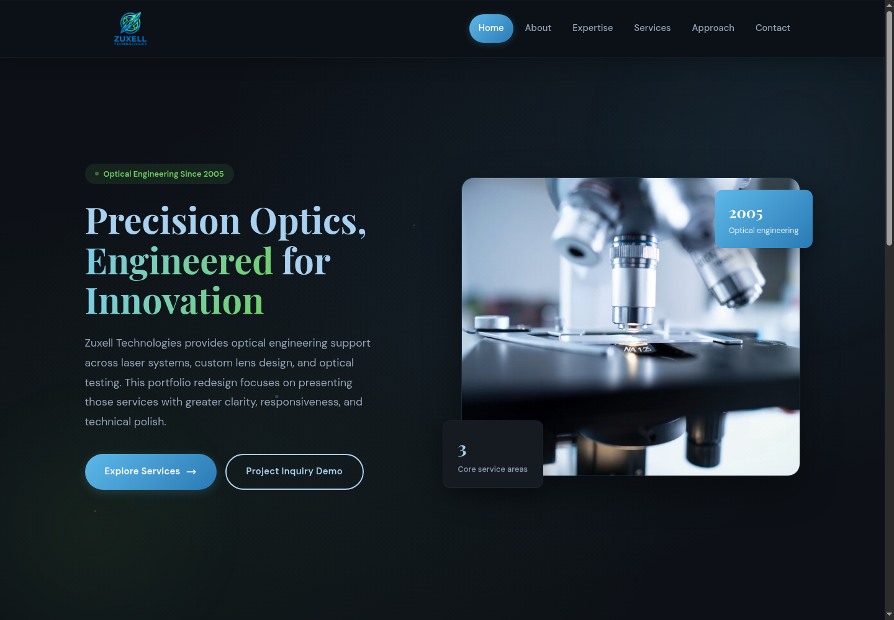
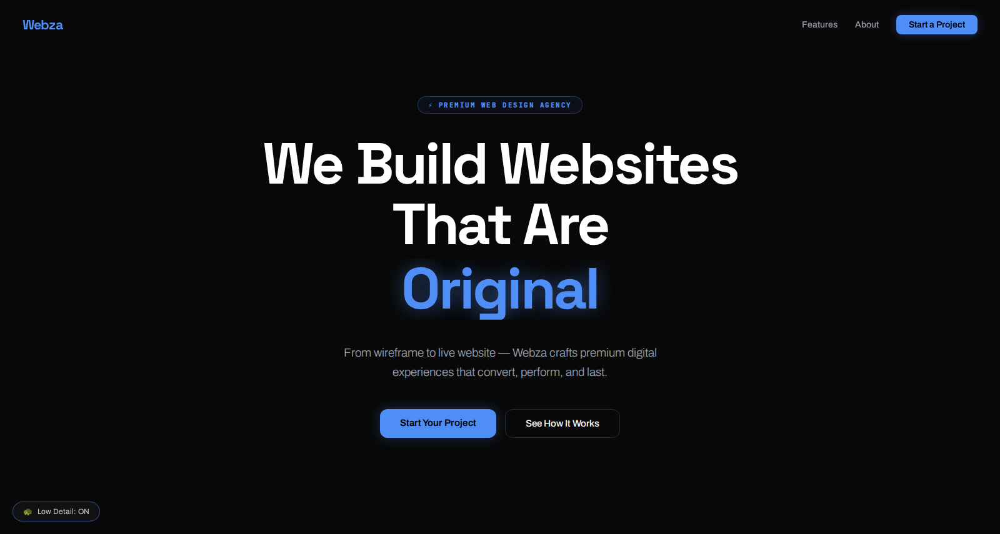
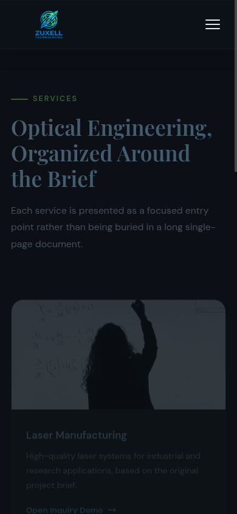
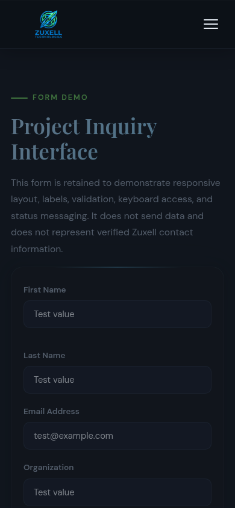

# Webza x Zuxell Technologies

**A four-person real-client web project that combined client acquisition, audience-specific design, front-end development, business thinking, iteration, and team execution for an optical engineering company.**

<p align="center">
  <a href="https://webza-zuxell-technologies-portfolio.vercel.app/"><strong>Live Zuxell showcase</strong></a>
</p>

> **Public showcase note:** Personal names, contact details, location information, and proprietary client material have been removed or generalized. The live site keeps only company information supported by the original project materials.

<table>
  <tr>
    <th width="50%">Zuxell Technologies</th>
    <th width="50%">Webza</th>
  </tr>
  <tr>
    <td></td>
    <td></td>
  </tr>
  <tr>
    <td align="center"><sub>Earlier public reconstruction capture showing the project's restrained technical direction. The live showcase reflects the latest cleanup.</sub></td>
    <td align="center"><sub>Original spring 2026 Webza capture, intentionally bolder because the agency itself was being marketed.</sub></td>
  </tr>
</table>

<p align="center">
  <a href="#why-we-made-it-real">Why</a> ·
  <a href="#two-products-two-audiences">Design</a> ·
  <a href="#project-iteration">Iteration</a> ·
  <a href="#technical-work">Technical work</a> ·
  <a href="#my-contribution">Contribution</a> ·
  <a href="#testing-and-reliability">Testing</a>
</p>

## At a glance

| | |
| --- | --- |
| **Project type** | Real-client web design and development |
| **Team** | Kevin Zhu, Vladimir Dukkardt, Michael Tetelbaum, Algasem Zabarah |
| **Development** | Late February to April 9, 2026 |
| **Client** | Zuxell Technologies |
| **Core stack** | HTML, CSS, JavaScript |
| **Products** | Zuxell client site and Webza agency site |
| **My role** | Real-client direction, client connection, business framing, shared product refinement, coordination, and project communication |
| **Testing** | Dependency-free Node smoke tests plus headless browser checks across desktop and mobile layouts |

## Why we made it real

The most important decision happened before most of the coding.

The assignment could have stayed hypothetical. Instead, our team formed **Webza** and tried to operate like a small web agency. We made a list of local businesses, divided outreach, and dealt with repeated rejections or no response. We kept looking because a fictional brief would let us define every requirement ourselves, while a real client would force us to design for someone else.

In early March, I connected the team with **Zuxell Technologies through my dad**. Zuxell worked in optical engineering and needed a stronger web presence. The requirements note we received called for five core areas: **Home, About Us, Expertise, Services, and Contact Us**, and pointed us toward an established optics-industry website as a design reference.

That changed the project. We now had to understand an unfamiliar technical business, decide what visitors needed first, and make the interface fit the client instead of our own preferences.

## Two products, two audiences

The project produced two connected websites, but using the same visual language for both would have defeated the point.

| | **Zuxell client site** | **Webza agency site** |
| --- | --- | --- |
| **Audience** | Engineering clients and technical visitors | Potential web-design clients |
| **Goal** | Establish clarity and technical credibility | Show personality, design capability, and service positioning |
| **Visual direction** | Restrained, precise, professional | Bold, expressive, pitch-driven |
| **Content focus** | Optical-engineering services and inquiry | Team, services, process, and agency identity |
| **Role in the project** | External client deliverable | Our own storefront and proof of concept |

The Zuxell direction centered the client around the three service areas preserved in our project materials: **laser manufacturing, lens design, and optical testing**. Webza could be more promotional because the agency itself was the product being marketed.

That contrast became one of the clearest lessons from the project: **design is a response to audience, purpose, and context, not a style that should be applied everywhere.**

## Project iteration

The surviving source history shows a meaningful change in both implementation and presentation.

<p align="center">
  
</p>

The **March 9** snapshot introduced the first complete client interface in one large `index.html`. By the **April 4** landing-page revision, structure, styling, and interaction had been separated into `index.html`, `style.css`, and `script.js`, alongside an optics-themed landing experience and a larger interaction layer.

The later public version in this repository takes a different kind of step. It keeps the lightweight browser stack but removes unsupported company claims, strips back unnecessary motion, improves keyboard and mobile behavior, separates the project explanation from the client-facing experience, and adds repeatable automated checks.

| Challenge or observation | Decision | What changed |
| --- | --- | --- |
| A fictional client would have been easier but less meaningful | Keep pursuing a real organization despite unsuccessful outreach | The project gained external constraints and a real stakeholder context |
| Optical engineering was unfamiliar to the team | Work from the client's requested structure and documented service areas | The information architecture became more grounded in the client's field |
| Zuxell and Webza had different audiences | Give the two sites intentionally different identities | Zuxell became restrained and technical while Webza became bolder and more promotional |
| The first Zuxell version was not treated as final | Return after March Break, clarify sections, and revise the landing-page direction | The project became an iteration process rather than a one-build submission |
| Michael and Vladimir were unavailable for stretches after March Break | Reprioritize tasks and keep both websites and the presentation moving | Team coordination became a practical project constraint |
| The agency, client, and two websites could feel like separate pieces | Rebuild the presentation around one sequence from Webza to outreach to Zuxell to revision to lessons | The final pitch communicated the project as one connected process |

The detailed chronology is preserved in [`docs/DEVELOPMENT_HISTORY.md`](docs/DEVELOPMENT_HISTORY.md), including the original journal, client brief, source snapshots, and the distinction between spring work and later public cleanup.

## Technical work

The project used browser fundamentals rather than a front-end framework. That made the technical challenge less about framework setup and more about organizing responsive layout, interaction, navigation, and client-specific presentation in a small codebase.

The current public site uses:

- semantic HTML and hash-based navigation for the five requested sections;
- responsive CSS for desktop, tablet, and narrow mobile layouts;
- keyboard-operable desktop and mobile navigation with focus management;
- reduced-motion support and visible focus states;
- a browser-only inquiry demonstration that validates data without creating a network submission path;
- a dependency-free local development server and browser smoke tests.

```text
index.html  -> structure and client-facing content
style.css   -> visual system and responsive layout
script.js   -> routing, mobile navigation, focus behavior, and inquiry validation
```

The current showcase deliberately removed the earlier full-screen entrance, rotating headline text, mouse glow, tilt effects, parallax, and other generic motion. The optics identity remains in the visual system, but the interface now prioritizes immediate access and technical credibility.

<table>
  <tr>
    <td width="50%"></td>
    <td width="50%"></td>
  </tr>
  <tr>
    <td align="center"><sub>Earlier mobile capture showing the responsive service presentation.</sub></td>
    <td align="center"><sub>Earlier mobile capture of the inquiry interface before the latest public cleanup.</sub></td>
  </tr>
</table>

## My contribution

This was collaborative work. My clearest ownership was at the intersection of **initiative, client and business direction, coordination, product refinement, and communication**.

| Area | My contribution |
| --- | --- |
| **Project direction** | Pushed the group toward a real-client engagement instead of leaving the assignment as a fictional brief |
| **Client acquisition** | Participated in outreach and ultimately connected the team with Zuxell Technologies through my dad |
| **Business framing** | Focused on what a client would value, how Webza should position its services, and why the project should feel like a real engagement |
| **Product refinement** | Contributed to implementation and revision while keeping design choices tied to the client and agency stories |
| **Coordination** | Helped keep the Zuxell site, Webza site, and project communication moving while teammate availability shifted |
| **Communication** | Helped shape the startup-style pitch, chronology, challenge explanations, design contrast, and final lessons |

The team's strengths overlapped. The surviving project record describes Michael as more coding-focused, Vladimir as more design and visuals-focused, Algasem as more presentation-focused, and me as more focused on business direction and making the project feel real.

I keep the contribution description at that level because the original work was collaborative and the later public repository is not a reliable module-by-module authorship record.

## Reflection

**I would formalize client onboarding earlier.** We had a requirements note, but a stronger engagement would define scope, revision expectations, content ownership, and a feedback schedule before development accelerated.

**I would make outreach more systematic.** We created a list and divided calls, but the process was improvised. A simple outreach tracker, clearer pitch, and follow-up plan would have made client acquisition more deliberate.

**I would plan around team availability sooner.** When availability changed after March Break, responsibility became less predictable. Clearer ownership and handoff points would have reduced coordination friction.

**I would review the story earlier.** The final presentation forced us to connect the agency, client, design choices, challenges, and revisions into one understandable sequence. Doing that review earlier would have improved both the product process and the explanation of our decisions.

The biggest lesson was that software becomes more demanding when the constraints come from real people. Technical implementation still matters, but so do trust, scope, communication, audience, revision, and the ability to explain why a design decision exists.

## Testing and reliability

The repository keeps testing intentionally lightweight because this project is primarily about real-client execution rather than testing infrastructure.

`npm test` checks:

1. JavaScript syntax and local server behavior;
2. the five navigation routes across desktop and mobile viewport sizes;
3. horizontal overflow and responsive layout stability;
4. mobile menu accessibility state and focus return;
5. local inquiry validation with no HTML form submission path;
6. missing image alt text, placeholder links, and local console failures;
7. public text files for prohibited long-dash characters and encoded variants.

The GitHub Actions workflow runs the same checks on pushes and pull requests.

## Project history and privacy

The original spring project was a four-person collaboration and included client material that should not be public. I keep the live reconstruction focused on the documented client services and design direction, while [`docs/DEVELOPMENT_HISTORY.md`](docs/DEVELOPMENT_HISTORY.md) records the timeline, source snapshots, and which media came from the original project versus later public cleanup.

I do not claim details I cannot reconstruct reliably, including an exact final client quotation, formal final approval before the April presentation, traffic, conversion, revenue, or a precise module-by-module authorship breakdown.

See [`ATTRIBUTION.md`](ATTRIBUTION.md) for screenshot, branding, photography, typography, and collaboration notes.

## Run locally

### Requirements

- Node.js 20 or newer for the local server and verification
- No install step and no runtime package dependencies

```bash
npm start
```

Open the local URL printed in the terminal.

To run the checks:

```bash
npm test
```

The site can also be opened directly from `index.html`, but the local server gives the same path used by the smoke tests.

## Repository map

- `index.html`: current public Zuxell reconstruction
- `style.css`: responsive visual system
- `script.js`: navigation, focus behavior, and inquiry validation
- `dev-server.js`: dependency-free local server
- `tests/`: content, server, and browser smoke checks
- `docs/DEVELOPMENT_HISTORY.md`: source-backed project chronology
- `docs/diagrams/`: development and implementation visuals
- `docs/assets/screenshots/`: preserved public Zuxell captures plus the original Webza capture
- `ATTRIBUTION.md`: collaboration and media notes

## Why this project mattered

Webza x Zuxell taught me what changes when a four-person team chooses external constraints on purpose: finding a real client, understanding an unfamiliar technical business, designing for two audiences, revising a first version, balancing two products, working through coordination problems, and communicating the result as one coherent project.

The code mattered, but the decision that defined the project came earlier: **we chose to make the problem real.**
