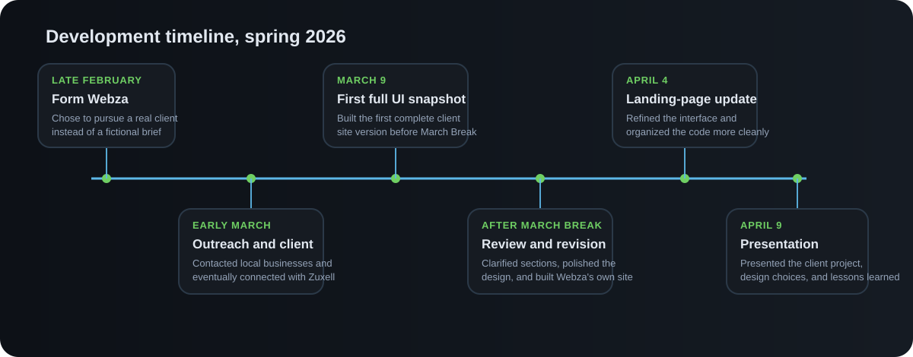
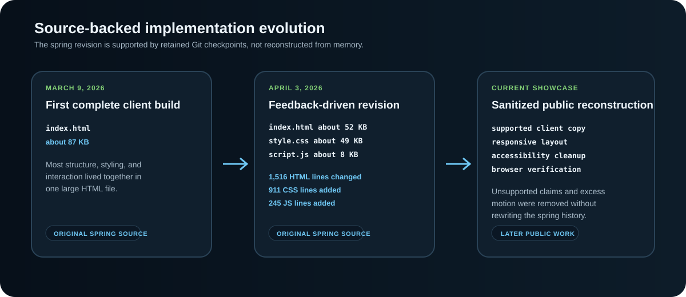

# Spring 2026 Development History

This page preserves the evidence trail for the original Webza x Zuxell Technologies project. The public repository also contains later showcase work, so original spring evidence and later portfolio work are kept explicitly separate.

<p align="center">
  
</p>

## Evidence and provenance

| Evidence | Period | What it supports |
| --- | --- | --- |
| Original project journal and presentation materials | Spring 2026 | Team roles, outreach, client acquisition, Webza service framing, challenges, feedback themes, final pitch, and reflections |
| Zuxell requirements note | Early March 2026 | The five requested site sections and the optics-industry reference supplied for the project |
| Zuxell source checkpoint `bde22b5...` | March 9, 2026 | First complete client interface with most structure, styling, and interaction in one large `index.html` |
| Zuxell source checkpoint `7b11eac...` | April 3, 2026 | Major landing-page and interaction revision with separate `index.html`, `style.css`, and `script.js` |
| Zuxell source checkpoint `c6cf279...` | April 3, 2026 | Image-path repair immediately after the larger revision |
| Original Webza capture and live agency site | Spring 2026 | The second product and its intentionally more promotional visual direction |
| Current Zuxell screenshots and public site | Later portfolio work | Sanitized reconstruction, accessibility improvements, responsive cleanup, and repeatable verification |

The original Zuxell development copy remains private because it contains client material and early placeholder claims that should not be republished. The hashes above are retained as provenance rather than public links.

## 1. From assignment idea to real-client project

The retained journal records the project sequence from late February through the final preparation days in April 2026.

The original team was **Kevin Zhu, Vladimir Dukkardt, Michael Tetelbaum, and Algasem Zabarah**. Early brainstorming produced several ideas that felt too generic or too tied to the assignment. The team moved toward a web-design agency concept because it created a path to work for a real organization rather than inventing all requirements internally.

Webza was framed around custom websites for businesses. That shift changed the project question from only what the team could code to who the work could help.

The team compiled local businesses, divided outreach, and dealt with repeated rejection or no response. In early March, Kevin connected the team with **Zuxell Technologies through a family connection**. Zuxell worked in optical engineering and needed a stronger online presence, giving the project a real external stakeholder and an unfamiliar technical domain.

## 2. Client requirements

The retained Zuxell requirements note listed five requested areas:

```text
Home
About Us
Expertise
Services
Contact Us
```

The same note pointed the team toward `https://www.opticsforhire.com/` as a design reference.

That created an external information structure instead of allowing the team to invent the entire brief. Personal contact details and identifying information from the original client communication are not republished.

## 3. First client build and feedback

The first complete Zuxell version was built before March Break. The journal describes the intended direction as clean, precise, trustworthy, and appropriate for optical engineering. The landing page was treated as the most important first impression.

The March 9 checkpoint records that first complete interface. At that stage, most structure, styling, and interaction were concentrated in one `index.html` of about 87 KB.

The team did not treat completion as final. After March Break, the journal records a return to feedback and revision. The surviving notes support these feedback-driven themes:

- make some sections clearer;
- polish the visual direction;
- strengthen the landing-page experience;
- continue building Webza's separate agency site at the same time.

The record does not preserve a final client quotation, so the public portfolio describes the feedback themes and resulting changes without inventing a testimonial.

## 4. Source-backed spring revision

The April 3 checkpoint provides unusually concrete evidence that the revision was not only cosmetic.

A direct comparison from the March 9 checkpoint to the April 3 revision records:

| File | Change |
| --- | --- |
| `index.html` | 210 additions and 1,306 deletions, for 1,516 changed lines |
| `style.css` | Added with 911 lines |
| `script.js` | Added with 245 lines |
| Logo asset | Reorganized into `assets/LOGOZuxell.png` |

The resulting revision separated the interface into roughly 52 KB of HTML, 49 KB of CSS, and 8 KB of JavaScript. The purpose of these numbers is not to treat line count as quality. They establish that the post-break revision changed the implementation substantially and separated concerns that had previously lived together.

The April interaction layer included:

- an optics-themed entrance;
- desktop and mobile tab navigation;
- contact interaction;
- scroll reveals;
- navbar scroll behavior;
- rotating headline text;
- animated counters;
- card tilt;
- parallax movement;
- a scroll-progress indicator;
- staggered reveal behavior.

Not every effect improved the client product. That became a useful design lesson later: technical capability and appropriate interaction are not the same thing. The current public reconstruction keeps the optics identity but removes motion that competes with the more restrained client direction.

<p align="center">
  
</p>

## 5. Two products for two audiences

While revising Zuxell, the team also built Webza's own agency site. The two products intentionally served different purposes.

Zuxell needed to communicate technical credibility. Webza needed to market the team's own service, so its direction could be bolder and more promotional.

The surviving Webza site presents service ideas around design, speed, mobile responsiveness, security, strategy, and support. The presentation materials also explored a proposed business model with an initial website build plus ongoing maintenance.

The pitch included a **$30 per month maintenance figure** and a classroom **$1,000 for 10% investment ask**. Those figures show business-model and pitch thinking. They are not evidence that Zuxell paid those amounts, that Webza earned revenue, or that the proposed investment structure existed outside the classroom presentation.

The original Webza deployment remains available at `https://webzacrew.netlify.app/`. It is preserved as a spring artifact, so its promotional agency copy should be read as part of the original student business concept rather than as verified company-performance claims.

## 6. Team execution and final pitch

Team availability changed after March Break. The journal records Michael and Vladimir being unavailable for stretches, which made coordination and handoffs more difficult while the team was revising Zuxell, building Webza, and preparing the final presentation.

The retained role notes describe **Michael and Kevin as handling much of the coding**, **Vladimir as leading much of the UI, design, and visual consistency**, and **Algasem as concentrating more heavily on presentation work**. Kevin also handled much of the client connection, business framing, pricing thinking, coordination, and project communication. These are broad responsibility areas, not a file-by-file authorship claim.

The final presentation was rebuilt around one chronological story: Webza idea, client search, Zuxell acquisition, first client build, feedback and revision, separate Webza site, challenges, business framing, and lessons. The team used a light and optics theme to connect the presentation visually with Zuxell's field.

## 7. Original and current media

The public repository distinguishes original media from later documentation:

- `assets/screenshots/webza-home.png` is an original spring 2026 capture of the Webza agency website;
- the surviving Webza deployment is an original spring artifact;
- `assets/screenshots/zuxell-home-current.png` is a current capture of the sanitized Zuxell reconstruction;
- `assets/screenshots/zuxell-services-current-mobile.png` and `assets/screenshots/zuxell-contact-current-mobile.png` are current mobile captures of the reconstruction;
- `diagrams/project-story.svg` was created later from the journal, requirements note, presentation materials, and source-history dates;
- `diagrams/implementation-evolution.svg` was created later from the March 9 and April 3 source checkpoints plus the current public implementation.

No untouched spring screenshot of the original Zuxell site survives in the retained materials. The portfolio therefore relies on the dated source checkpoints for original Zuxell implementation evidence and clearly labels newer Zuxell captures as reconstruction media.

## 8. Public reconstruction decisions

The current Zuxell site is not presented as an untouched spring artifact. It is a later public reconstruction built from the surviving project direction while respecting privacy and the limits of the retained evidence.

The later cleanup intentionally:

- removes unsupported company statistics, certifications, client logos, testimonials, and other placeholder claims;
- limits company copy to service areas and background information supported by the project materials;
- removes the blocking entrance screen and several generic motion effects;
- keeps the optics-inspired identity while making the client-facing copy more direct;
- improves keyboard navigation, mobile focus handling, visible focus states, and reduced-motion behavior;
- changes the inquiry interface so there is no HTML form submission endpoint;
- adds local and browser smoke tests for repeatable checks.

These changes improve the public artifact, but they are not retroactively described as original spring work.

## 9. Claim boundaries

Some details were never tracked closely enough to support a reliable number or quotation. The surviving record does not provide:

- an exact count of every business contacted before Zuxell;
- a final client testimonial or exact final-feedback quotation;
- a record of formal final client approval before the April 9 pitch;
- traffic, conversion, revenue, retention, sales, or measured business-growth results;
- a precise module-by-module breakdown of exactly what each teammate authored during the original project.

Rather than guess at those details later, the public portfolio focuses on the parts of the project that are directly supported.

## Why this history matters

The strongest part of the project is the process behind it: choosing to pursue a real client, working from somebody else's requirements, learning enough about an unfamiliar technical business to design for it, building two products for two audiences, revising the first client version, and coordinating a team while the work was moving.

Keeping spring evidence separate from later portfolio cleanup preserves that story without blurring what happened during the original project and what was improved afterward.